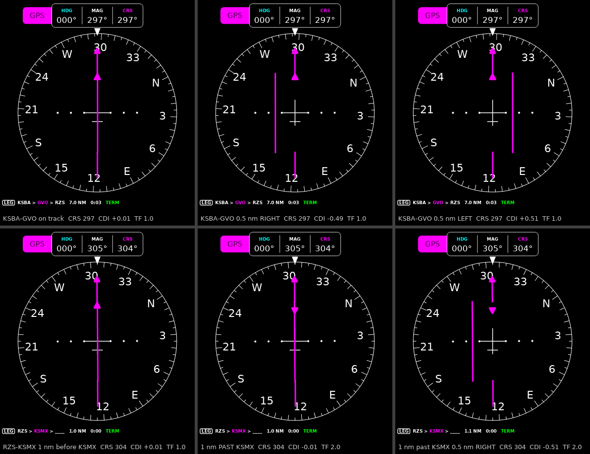

# Flight plan validation

The record of the flight plan stack verified end to end: route block,
fix-gateway `flightplan` engine, `GPSSRC`/`NAVSRC` selects, and the pyEfis
displays. FP7 (billmallard/pyEfis#189) started this file with the HSI check;
FP8 (billmallard/pyEfis#190) owns it and adds the bench flight against X-Plane
and the playback fixture. Spec: `makerplane/briefs/flight_plan_plan.md`
sections 3.3, 3.6 and 6 (maos-workspace).

Each item carries a verdict: **PASS**, **FAIL** (with the defect filed), or
**NOT RUN** (with what it is waiting on).

## 1. HSI driven by the internal plan (`NAVSRC = 2`, `GPSSRC = 0`)

The HSI is not modified by the flight plan epic. It reads only `COURSE`,
`CDI`, `TOFROM`, `NAVSRC` and `NAVTYPE`. This checks that those keys carry the
engine's guidance with the right sense.

**Setup (2026-10-04).** A real fix-gateway with only
`netfix`, `compute` and `flightplan` enabled; the real pyEfis `HSI` and
`nav_status` widgets connected to it and rendered offscreen. Route KSBA > GVO >
RZS > KSMX published as the route block. Position, `GS = 120`, `MAGVAR = 0`
and `HEAD` written over netfix at known offsets from the active leg. Nothing
between the route block and the HSI is mocked. Driver, renders and the full
key dump: `docs/images/fp7_hsi/` (README has the commands).

First run against `dev` @ `aebde02`: the course pointer turned to the
reciprocal past KSMX (billmallard/fix-gateway#35). Re-run against the fix,
branch `aer-2672/fplcrs-past-to` @ `aa794ab`; the table and renders below are
from that run. The four points before KSMX are byte-identical between the two
runs.

This is not the Beelink bench. X-Plane was not feeding the bench gateway at
the time (`LAT`/`LONG` old), and the bench was holding another branch for
review. The engine, selects and widgets are the same code; the display stack
is offscreen Qt rather than the kiosk.

| Point | `FPLCRS` | `COURSE` | `FPLXTK` (nm) | `FPLCDI` | `CDI` | `TOFROM` | HSI shows |
|---|---|---|---|---|---|---|---|
| KSBA-GVO on track | 296.98 | 296.98 | -0.005 | +0.005 | +0.005 | 1 TO | bar centred |
| KSBA-GVO 0.5 nm right | 296.98 | 296.98 | +0.495 | -0.495 | -0.495 | 1 TO | bar left of centre (fly left) |
| KSBA-GVO 0.5 nm left | 296.98 | 296.98 | -0.505 | +0.505 | +0.505 | 1 TO | bar right of centre (fly right) |
| KSBA-GVO 1.0 nm right | 296.98 | 296.98 | +0.995 | -0.995 | -0.995 | 1 TO | full scale left (TERM, 1.0 nm) |
| KSBA-GVO 2.0 nm right | 296.98 | 296.98 | +1.995 | -1.000 | -1.000 | 1 TO | pegged left |
| RZS-KSMX 1 nm before KSMX | 304.41 | 304.41 | -0.007 | +0.007 | +0.007 | 1 TO | bar centred |
| 1 nm past KSMX | 304.39 | 304.39 | +0.007 | -0.007 | -0.007 | 2 FROM | bar centred, pointer holds 304 |
| 1 nm past KSMX, 0.5 nm right | 304.39 | 304.39 | +0.507 | -0.507 | -0.507 | 2 FROM | bar left of the 304 pointer (fly left) |

`FPLPHASE` was `TERM`, `CDISCALE` 1.0, throughout (every point is inside 30 nm
of KSBA or KSMX).

| Check | Verdict |
|---|---|
| Course pointer follows `FPLCRS` (`COURSE == FPLCRS == GPSCRS`) | **PASS** |
| `CDI == FPLCDI == -FPLXTK / CDISCALE`, clamped at +-1 | **PASS** |
| Sense: right of track -> bar left of centre (fly left), and the reverse | **PASS** |
| TO/FROM flips after the last waypoint, no sequencing | **PASS** (flag) |
| Course and sense hold FROM the last waypoint | **PASS** -- after billmallard/fix-gateway#35. On `aebde02` this was a FAIL: `FPLCRS` swung to the reciprocal (124.39) once along-track went negative, so the needle reversed. The fix keeps the extended leg course (304.39; the 0.02 deg from 304.41 is great-circle convergence over 2 nm). The same path runs at the MAP and in SUSP past a fix; both are pinned by fix-gateway engine tests rather than this render. |

## 2. Internal plan vs X-Plane's FMS (`GPSSRC = 1`)

**NOT RUN.** Needs X-Plane flying the same route with its FMS feeding
`EXTCRS`/`EXTCDI`/`EXTTF` into the bench gateway. On 2026-10-04 the Beelink
gateway's `LAT`/`LONG`/`GS` were old (no simulator connected).

Acceptance (brief section 6): DTK within 2 deg; CDI the same sign and within
0.1 of full scale at 1 nm cross-track; sequencing point within 0.3 nm.

| Point | `FPLCRS` | `EXTCRS` | diff | `FPLCDI` | `EXTCDI` | diff | Verdict |
|---|---|---|---|---|---|---|---|
| KSBA-GVO on track | | | | | | | |
| KSBA-GVO 1 nm right | | | | | | | |
| KSBA-GVO 1 nm left | | | | | | | |
| GVO sequence point | | | | | | | |

## 3. Bench flight (FP8)

To be written by FP8: keypad and USB keyboard entry, direct-to mid-leg, SUSP,
gateway and pyEfis restarts, the RNAV approach at KSMX, and the playback
fixture.
