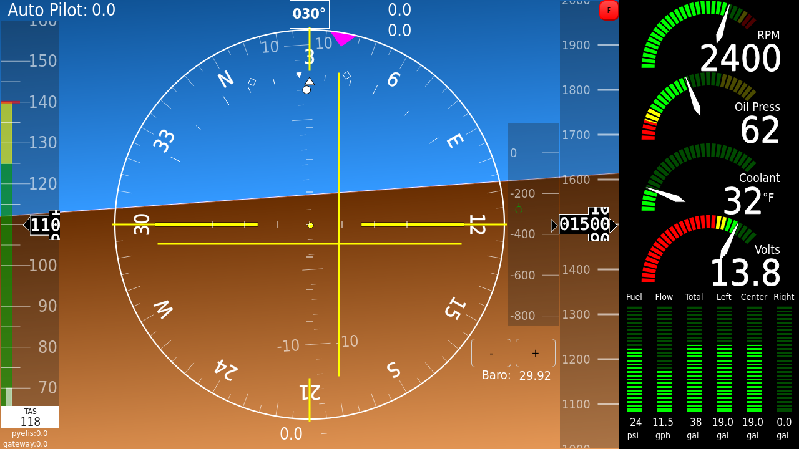
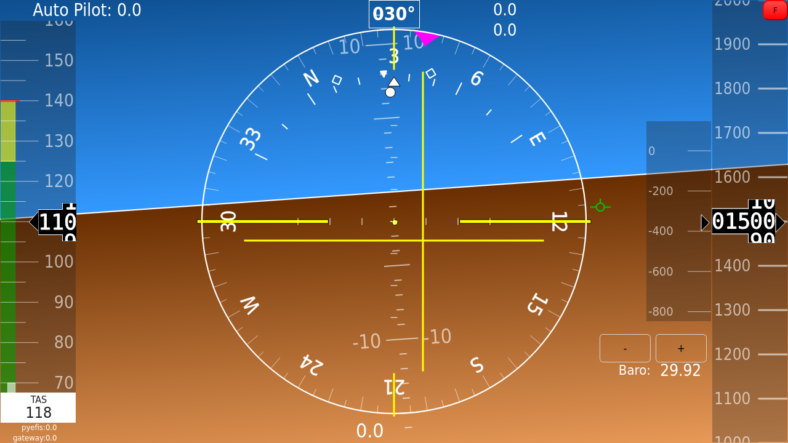
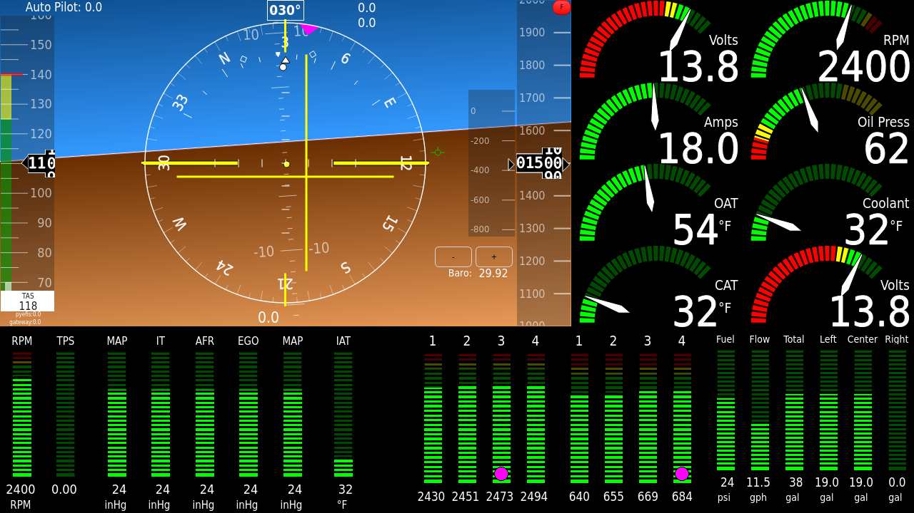
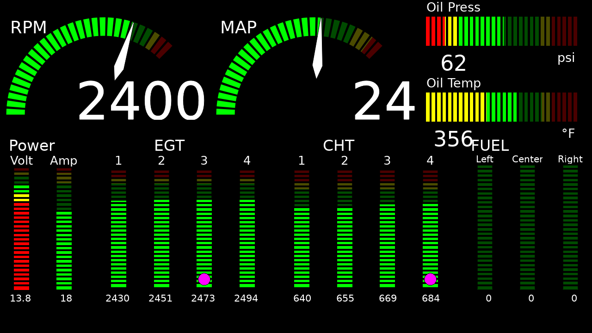
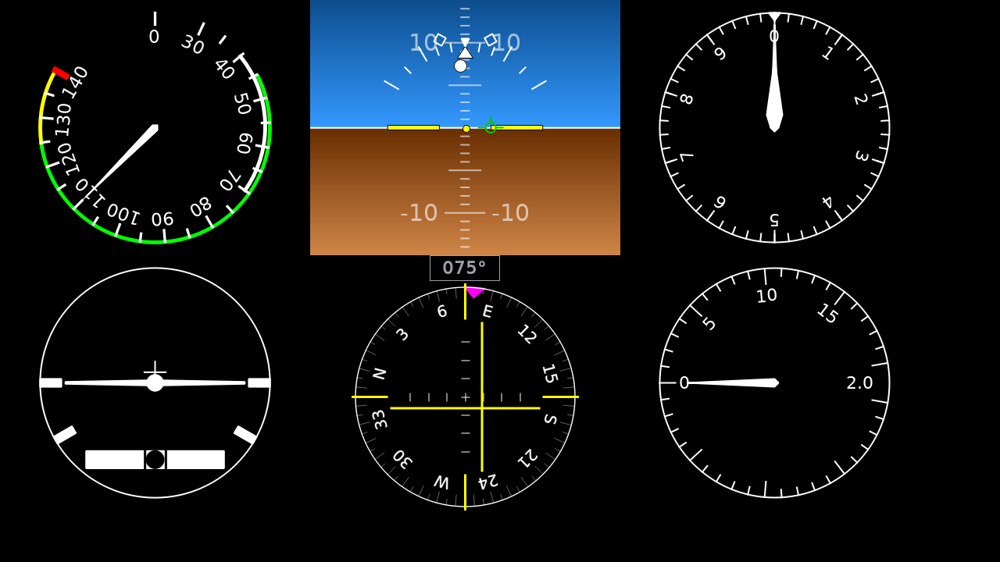
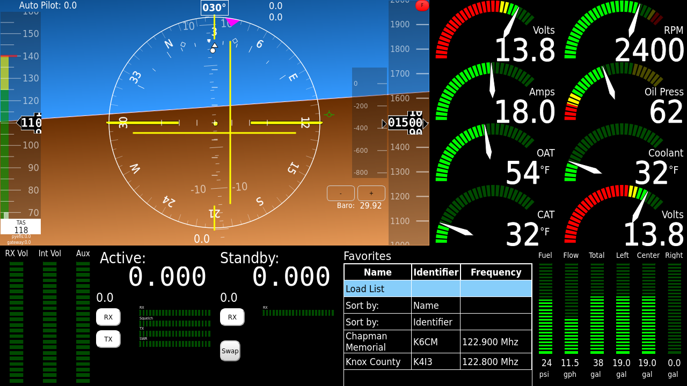
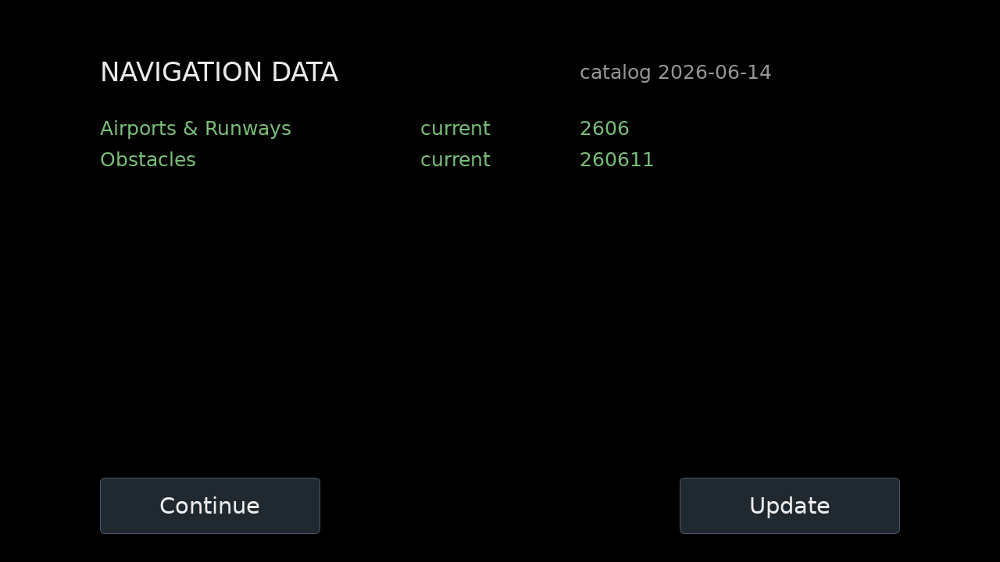

# Screens Overview

A **screen** is a full-display layout: one PyQt6 window's worth of widgets,
positioned on a virtual grid by the **screen builder**
(`pyefis.screens.screenbuilder`). pyEFIS does not hard-code its panels — every
shipped screen is just a YAML file describing a grid and a list of instruments,
and the same layout scales to any physical resolution. This page catalogs the
screens pyEFIS **ships with**, explains how the active set is chosen and which
one comes up first, and how the pilot moves between them.

You can fly the shipped set as-is, or customize it: change which screens load,
re-skin the gauges, and toggle features through
[Preferences & Styling](Preferences-and-Styling), or build entirely new screens
with the [Screen Builder](Screen-Builder). To operate these screens in the
cockpit, see the [Pilot's Guide](Pilots-Guide).

> Screenshots of the assembled screens will be added in a later documentation
> pass. This page describes each screen's contents from its config.

---

## Choosing which screens load & the default

Screens are pulled into the running config through the include system described
in [Preferences & Styling](Preferences-and-Styling). The top-level
`config/default.yaml` does not name screens directly; it pulls a named slot:

```yaml
screens:
  include: SCREENS_CONFIG
```

`SCREENS_CONFIG` (like `MAIN_CONFIG`, `KEYBINDING_CONFIG`, etc.) is resolved by
the loader: it first tries a literal file path, then falls back to the
`includes:` map in `preferences.yaml`
(`screens/screenbuilder_config.py → load_include_config`). There:

```yaml
includes:
  SCREENS_CONFIG: screens/default_list.yaml
```

`screens/default_list.yaml` is just an ordered list of more named includes — the
**set of screens that load**:

```yaml
include:
  - SCREEN_DATA_STATUS   # screens/datastatus.yaml
  - SCREEN_SIXPACK       # screens/sixpack.yaml
  - SCREEN_PFD           # screens/pfd.yaml
  - SCREEN_PFD_AI_ONLY   # screens/pfd_ai_only.yaml
  - SCREEN_RADIO         # screens/radio.yaml
  - SCREEN_EMS           # screens/ems.yaml
  - SCREEN_EMS2          # screens/ems2.yaml
```

Each `SCREEN_*` name maps to a file in the `includes:` block of
`preferences.yaml` (e.g. `SCREEN_PFD: screens/pfd.yaml`). To add or remove a
screen, edit this list (in your `preferences.yaml.custom` or your own
`SCREENS_CONFIG` file); to swap which file fills a slot, edit the `SCREEN_*`
mapping (this is how the portrait variants are enabled — see
[Layout variants](#layout-variants)).

- **The shipped default set loads seven screens.** Note that **Android is *not*
  in the default list** even though a side-button to reach it exists — the
  `SCREEN_ANDROID` mapping is defined in `preferences.yaml`, but
  `default_list.yaml` does not include it. Add `SCREEN_ANDROID` to the list to
  enable that button's target.

**The default (first-shown) screen** is set in the `main:` section
(`main/default.yaml`):

```yaml
defaultScreen: DataStatus
```

If `defaultScreen` is omitted, the **first** screen in the loaded list is used
(`gui.py → initialize`). The shipped config boots to **Data Status** so the
pilot sees navigation-data currency at startup; its *Continue* button proceeds
to the PFD. Set `defaultScreen: PFD` to skip the boot screen.

### `nodeID`

`main/default.yaml` defines `nodeID: 1`. The node ID identifies *this* display.
Its main use is in **touchscreen buttons**: a button config's `dbkey` containing
`{id}` has `{id}` replaced by the `nodeID` (e.g. `TSBTN{id}12` →
`TSBTN112`), so one button config file can serve several physical displays on
the same bus without colliding. See [Screen Builder](Screen-Builder) and the
button mechanics in
[Text & Interactive Widgets](Widgets-Text-and-Interactive#button).

---

## The shipped screens

| Screen | File | Purpose | Key contents |
|--------|------|---------|--------------|
| **Data Status** | `screens/datastatus.yaml` | Boot / navdata-currency screen | full-screen `data_status` widget; *Continue* + *Update* |
| **PFD** | `screens/pfd.yaml` | Primary flight display | Virtual VFR AHRS bundle + engine arc column + side button bar; alternating radio / fuel panel |
| **AI-only PFD** | `screens/pfd_ai_only.yaml` | Full-width attitude/SVS, no engine or radio | AHRS bundle stretched to full width + navdata flag |
| **EMS** | `screens/ems.yaml` | Engine monitoring with attitude | AHRS bundle + arc columns + EGT/CHT strips + power bars + EGT-mode buttons |
| **EMS2** | `screens/ems2.yaml` | Dedicated engine page (no AHRS) | RPM/MAP arcs, oil bars, EGT/CHT/Power/Fuel strips, EGT-mode buttons |
| **Six-Pack** | `screens/sixpack.yaml` | Traditional steam-gauge panel | round airspeed, AI, altimeter, turn coordinator, HSI, VSI |
| **Radio** | `screens/radio.yaml` | Radio control | AHRS bundle + arc columns + combined MGL V16 radio panel + listbox |
| **Android** | `screens/android.yaml` | Embedded Android app | `weston`/waydroid panel + arc column + button bar *(not in the default list)* |

> **Screenshots:** Six-Pack, EMS2, and Data Status are rendered by the screenshot
> harness on a PC (`tests/screenshots/`, run with `GENERATE_SCREENSHOTS=1`). The
> Virtual-VFR screens (PFD, AI-only PFD, EMS, Radio) use a GL widget that won't
> initialise under the offscreen platform, so they are captured on the Pi via
> `tools/capture_gl_screens.py`. On both paths the attitude widget shows the
> sky/ground attitude reference; **live SVS terrain appears in flight** (see
> [Attitude & SVS](Widgets-Attitude-and-SVS)). All shots use representative mock
> data, not a live aircraft.

Every flight screen uses `module: pyefis.screens.screenbuilder` and a virtual
grid (most are `110 × 200`; Data Status is `100 × 100`). All except EMS2,
Six-Pack and Android pull `screens/virtualvfr_db.yaml` (the CIFP data paths for
the AHRS/SVS) and all flight screens pull `HMI_ENCODER_BUTTONS` (the encoder
input wiring). The recurring "AHRS bundle" is the
`includes/ahrs/virtual_vfr.yaml` include, described under PFD below.

### PFD — Primary Flight Display

The standard flight screen. Its layout is dominated by the **AHRS bundle**
(`includes/ahrs/virtual_vfr.yaml`), which is a single include reused by the PFD,
EMS, Radio and AI-only PFD. That bundle contains:

- a `virtual_vfr` widget (attitude indicator with the optional Synthetic Vision
  terrain overlay — SVS is off by default; see
  [Attitude & SVS](Widgets-Attitude-and-SVS)),
- an overlaid `horizontal_situation_indicator` (HSI),
- `airspeed_tape` and `altimeter_tape`,
- a vertical-speed indicator (`vsi_pfd` or a VS tape, gated by the `VSI_TAPE` /
  `VSI_BALL` flags),
- `heading_display`, `wind_display`, baro / pressure-altitude / DALT / OAT
  readouts, time displays, autopilot status, aircraft ID, trim controls, a
  dimmer, and version readouts — most individually gated by an `enabled:` flag.

To the right, the PFD adds a column of four engine **arc gauges**
(`includes/arcs/vertical/four_high_two_states_preferences_ARC1-8.yaml` →
RPM / oil / coolant / volts), a vertical **side button bar**
(`BUTTON_GROUP1`), and a bottom-right panel that **alternates every 3 s**
(`display_state`) between a six-wide fuel **bar** strip and a square MGL V16
**radio** display. A small `data_annunciation` flag overlays the top-left of the
AI and turns amber when navdata is expired (tap it to jump to Data Status).

Use the PFD as the everyday flight screen.



### AI-only PFD

`PFD_AI_ONLY` runs the same AHRS bundle stretched to the **full display width**,
with the engine-arc column, fuel/radio panel and side buttons removed. Use it on
hardware that is tight on CPU budget for SVS, or for focused SVS development and
demos. It keeps only the navdata-currency flag. Make it the boot screen with
`defaultScreen: PFD_AI_ONLY`.



### EMS — Engine Management (with attitude)

A combined engine + attitude page. It carries the same AHRS bundle (narrower, on
the left), **two arc columns** (RPM/oil/coolant/volts plus
volts/oil-temp/OAT/amps from `ARC9-12`), and the engine strips along the bottom:
ganged **EGT** and **CHT** `vertical_bar_gauge` columns
(`4_EGT.yaml` / `4_CHT.yaml`), a six-wide fuel bar strip, and a ganged power /
engine / temps bar group. A small vertical group of **EGT-mode buttons**
(Normalize / Lean / Peak / Reset-Peak — see
[Engine Gauges → EGT modes](Widgets-Engine-Gauges#egt-modes-engine-leaning))
drives the leaning behavior. Use EMS when you want engine detail without giving
up the attitude view.



### EMS2 — Engine page (no attitude)

A dedicated engine screen with **no AHRS**. It shows large RPM and MAP **arc
gauges** (`ARC13`/`ARC14`), oil pressure/temperature **horizontal bars**
(`BAR7`/`BAR8`), and a wide row of ganged **vertical bar** strips grouped as
**Power / EGT / CHT / Fuel**, labeled by `static_text` headers, plus the
horizontal EGT-mode button row. Use EMS2 as a full engine-analysis page (e.g.
during run-up or leaning) when attitude is shown on another display.



### Six-Pack

The traditional six-instrument "steam gauge" panel, built from round analog
widgets rather than tapes: `airspeed_dial`, `atitude_indicator`,
`altimeter_dial` across the top; `turn_coordinator`,
`horizontal_situation_indicator` (with a `heading_display`), and `vsi_dial`
across the bottom. It pulls only the encoder wiring and the side button bar — no
AHRS bundle, no engine column. Use it as a familiar backup-instrument layout.



### Radio

A radio-tuning screen. It runs the AHRS bundle and the two engine arc columns
(like EMS, minus the bottom engine strips), then fills the lower area with the
**combined MGL V16 radio panel** (`RADIO_COMBINED` → active/standby frequency
displays, volume controls, and a frequency **listbox**). A second radio entry is
present but `disabled: true` as an example of wiring more than one radio. The
radio feature is a work in progress pending MGL V16 hardware. Use this screen to
tune and select frequencies.



### Android

`ANDROID` embeds an Android app via the `weston` widget (waydroid), alongside an
engine-arc column, the side button bar, and the same alternating fuel/radio
panel as the PFD. It is **not loaded by the default screen set** — add
`SCREEN_ANDROID` to your `SCREENS_CONFIG` list to use it (and the Android side
button). Use it to surface an Android EFB/app next to the engine data.

### Data Status

A full-screen `data_status` widget (the navigation-data updater UI). It reports
the currency of installed nav data (airports, obstacles, terrain, …) and offers
a *Continue* button (always available) and an *Update* button (over-the-air; USB
sticks are imported automatically). It is the shipped **boot screen**; *Continue*
returns to its `continue_screen` (default `PFD`). See
[System & Status Widgets](Widgets-System) for the widget itself.



---

## Switching screens

The pilot moves between screens using the **side button bar** that most flight
screens include via `BUTTON_GROUP1`
(`includes/buttons/vertical/screen_changing_PFD-EMS-EMS2-ANDROID-RADIO-SIXPACK-Units.yaml`).
There is also a horizontal variant (`BUTTON_GROUP2` /
`includes/buttons/horizontal/...`). The bar is a `ganged_button` group whose
members each point at a screen-change button config in `config/buttons/`:

| Button config | Reaches | DB key |
|---------------|---------|--------|
| `screen-ems-pfd.yaml` | EMS ↔ PFD | `TSBTN{id}12` |
| `screen-ems2-pfd.yaml` | EMS2 ↔ PFD | `TSBTN{id}20` |
| `screen-android-pfd.yaml` | Android ↔ PFD | `TSBTN{id}19` |
| `screen-radio-pfd.yaml` | Radio ↔ PFD | `TSBTN{id}14` |
| `screen-sixpack-pfd.yaml` | Six-Pack ↔ PFD | `TSBTN{id}18` |
| `screen-map-pfd.yaml` | Android (map) ↔ PFD | `TSBTN{id}13` |
| `units.yaml` | toggles instrument units / shows hidden bar | `TSBTN{id}15` |

Each screen-change button is a **toggle to-and-from the PFD**: its conditions
read the built-in `SCREEN` variable (the name of the screen the button is drawn
on). On the EMS screen the EMS button shows `PFD` and its action is
`show screen: PFD`; on every other screen it shows `EMS` and its action is
`show screen: EMS`. The same pattern applies to each button, so the bar always
offers one tap to a target screen and one tap back to the PFD.

**Annunciation.** The EMS and EMS2 buttons also watch the engine keys
(`condition_keys: CHT11..14`, `EGT11..14`). When any of those keys is
**annunciating** and you are not already on that screen, the button's background
turns **red** — a glanceable engine alert that also tells you where to look.
This is ordinary button-condition behavior; the mechanics (`when` / `actions` /
`continue`, the `SCREEN` / `CLICKED` / `HIDEBUTTON` variables, and the
`show screen` action) are documented in
[Text & Interactive Widgets](Widgets-Text-and-Interactive#button).

Buttons can also be hidden behind a `HIDEBUTTON` flag and revealed on hover
(`hover_show`), and the *Units* button doubles as a "Show Menu" toggle when the
bar is hidden. The same screen changes are also reachable from the keyboard via
keybindings and from a single rotary **encoder** (each button carries an
`encoder_order`); see [Concepts §6](Concepts#6-encoder-interaction) and
[Screen Builder](Screen-Builder#encoder-control).

There is a second button set, `screen_changing_PFD-EMS-MAP-RADIO-AP-Units.yaml`
(both orientations), offering a PFD/EMS/Map/Radio/Autopilot/Units bar as an
alternative wiring.

---

## Layout variants

Most flight screens ship in alternate layouts of the same content, selected by
pointing the `SCREEN_*` include at a different file (no need to edit the screen
itself):

- **`*-portrait.yaml`** — portrait-oriented re-layouts (`pfd-portrait.yaml`,
  `ems-portrait.yaml`, `ems2-portrait.yaml`, `sixpack-portrait.yaml`,
  `radio-portrait.yaml`, `android-portrait.yaml`) for tall displays. The
  `includes:` comments in `preferences.yaml` show the swap, e.g.
  `SCREEN_PFD: screens/pfd.yaml   # screens/pfd-portrait.yaml`.
- **`*-left-buttons.yaml`** — the same screen with the side button bar / columns
  moved to the **left** edge (`pfd-left-buttons.yaml`, `ems-left-buttons.yaml`,
  `ems2-left-buttons.yaml`, `sixpack-left-buttons.yaml`,
  `radio-left-buttons.yaml`, `android-left-buttons.yaml`) — useful when the
  pilot sits on the right, or for a co-pilot display.

These are alternate layouts of the *same* screen name (e.g.
`pfd-left-buttons.yaml` still defines `PFD:`); you select one by mapping its
`SCREEN_*` slot to that file.

---

## Customizing

- To change **which** screens load, the **default** screen, or which file fills
  a `SCREEN_*` slot (portrait / left-button variants), edit the `includes:` and
  `screens/default_list.yaml` as above — all overridable from
  `preferences.yaml.custom`. See [Preferences & Styling](Preferences-and-Styling).
- To toggle features on the shipped screens (HSI, VSI tape, trim controls,
  cylinder count, the button bar itself via `BUTTONS`, …), use the `enabled:`
  flags — each `disabled:` line on a screen instrument names one. See
  [Concepts §7](Concepts#7-preferences--styling) and
  [Preferences & Styling](Preferences-and-Styling).
- To build a **new** screen from scratch — the grid, includes, ganged
  instruments, `display_state` cycling, encoder wiring — see
  [Screen Builder](Screen-Builder). For the widgets you place on it, see the
  [Widget Reference](Widget-Reference).
