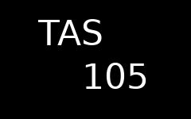
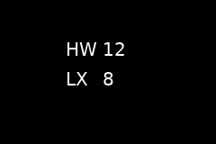

# Flight Instruments

These are the **primary-flight-display (PFD)** instruments — airspeed, altitude,
vertical speed, heading, the HSI, the turn coordinator, and the wind readout.
Unlike the [engine & data gauges](Widgets-Engine-Gauges), each flight instrument
has a **default FIX key wired in** and reads its scale/limit information either
from the key's aux values (the airspeed V-speeds) or from hard-coded ranges.

**Read [Concepts](Concepts) first** — this page only documents what is specific
to each instrument. The shared [FIX/data-bus model](Concepts#1-the-fix-database-the-data-bus),
[data-quality states](Concepts#3-data-quality--states),
[fonts/masks](Concepts#4-fonts-masks--ghosting), and
[layout/grid model](Concepts#5-layout-grid-span-move-ganging) all apply here.

> **None of the flight instruments are encoder-selectable.** Encoder interaction
> (`encoder_order`, value editing) is implemented only by the gauges, `button`,
> and `listbox`. Do not set `encoder_order` on these widgets.

`font_family` and `font_percent` come from [preferences](Preferences-and-Styling)
and are passed to the constructor, not via `options:` (see
[Concepts §8](Concepts#8-how-options-reach-a-widget)). They are noted in the
tables but not belabored.

---

## Summary

| `type:` | Class | Default FIX key(s) | Description |
|---------|-------|--------------------|-------------|
| `airspeed_dial` | `airspeed.Airspeed` | `IAS` | Round analog airspeed dial with colored V-speed arcs |
| `airspeed_box` | `airspeed.Airspeed_Box` | `IAS` / `GS` / `TAS` | Compact numeric readout, mode-switchable IAS/GS/TAS |
| `airspeed_tape` | `airspeed.Airspeed_Tape` | `IAS` (+ `TAS`) | Vertical scrolling airspeed tape with V-speed bands, TAS box, trend arrow |
| `airspeed_trend_tape` | `vsi.AS_Trend_Tape` | `IAS` | Standalone airspeed-trend bar |
| `altimeter_dial` | `altimeter.Altimeter` | `ALT` | Three-hand round analog altimeter |
| `altimeter_tape` | `altimeter.Altimeter_Tape` | `ALT` | Vertical scrolling altitude tape with numeric box |
| `altimeter_trend_tape` | `vsi.Alt_Trend_Tape` | `ALT` (reads `VS`) | Vertical-speed trend bar with a numeric VSI readout |
| `vsi_dial` | `vsi.VSI_Dial` | `VS` | Round analog vertical-speed indicator |
| `vsi_pfd` | `vsi.VSI_PFD` | `VS` | Compact PFD vertical-speed scale with a moving dot |
| `heading_display` | `hsi.HeadingDisplay` | `HEAD` | Boxed three-digit digital heading (e.g. `030°`) |
| `heading_tape` | `hsi.DG_Tape` | `HEAD` | Horizontal scrolling heading/compass tape |
| `horizontal_situation_indicator` | `hsi.HSI` | `COURSE`, `CDI`, `GSI`, `HEAD` | Rotating compass card with heading bug, CDI and glideslope |
| `turn_coordinator` | `tc.TurnCoordinator` | `ROT`, `ALAT` | Rate-of-turn aircraft + inclinometer (slip/skid) ball |
| `wind_display` | `wind.WindDisplay` | `HWIND`, `XWIND` | Two-row headwind/tailwind + crosswind readout |

> The `altimeter_trend_tape`'s "default key" is `ALT` per the screen-builder
> defaults table, but the widget itself subscribes to **`VS`** — it draws a
> vertical-speed trend bar and a VSI number, not an altitude trend. See its
> section below.

---

# Airspeed

## `airspeed_dial`

A round analog airspeed dial. The colored arcs (green/yellow/white bands and the
red Vne mark) are drawn from the **`IAS` key's aux V-speed values**
(`Vs`, `Vs0`, `Vno`, `Vne`, `Vfe`) — set them in fix-gateway, not the YAML (see
[FIX aux values](Concepts#aux-values)). The needle covers 0–140 kt with the
standard non-linear airspeed scale (compressed below 30 kt).


```yaml
- type: airspeed_dial
  row: 0
  column: 0
  span: {rows: 50, columns: 50}
```

- **FIX keys:** reads `IAS`; reads aux values `Vs`, `Vs0`, `Vno`, `Vne`, `Vfe`
  from `IAS` (V-speed defaults are `Vne=200`, all others `0` when the aux value
  is absent).
- On **fail** the dial shows `XXX`; on **old/bad** the needle dims to gray.

| Option | Default | Meaning |
|--------|---------|---------|
| `bg_color` | `black` | dial background fill |
| `font_family`, `font_percent` | from preferences (`font_percent` default `0.07`) | scale-number font |

The `IAS` key is fixed; this widget has **no `dbkey:` option**.

## `airspeed_box`

A compact numeric readout that shows one of three speeds and cycles between them.
Unlike a plain text widget it changes content on data-quality flags: `XXX` on
fail, blank on old/bad. The displayed speed is switched by the HMI action
`setAirspeedMode` (a button bound to it), not by the encoder.



- **FIX keys:** reads `TAS`, `GS`, `IAS` (cycles in that order — `modes =
  ["TAS", "GS", "IAS"]`). The label drawn (`TAS`/`GS`/`IAS`) reflects the
  current mode.

| Option | Default | Meaning |
|--------|---------|---------|
| `small_font_percent` | **0.4** | font size as a fraction of widget height (used for both the mode label and the value) |
| `color` | `white` | text color |
| `alignment` | left / vertically-centered | alignment of the mode label |
| `valueAlignment` | right / vertically-centered | alignment of the value |
| `font_family` | from preferences | |

## `airspeed_tape`

A vertical scrolling airspeed tape: a fixed read pointer with the scale moving
behind it, the V-speed color bands (green/white/yellow bars and the red Vne
line), an embedded numeric readout box, an optional solid-white **TAS box** at
the bottom, and an optional **trend arrow** projecting where speed will be in a
few seconds. The bands come from the `IAS` aux V-speeds, and the tape's top of
scale is `Vne × 1.25`.


- **FIX keys:** reads `IAS` (primary scroll + trend), `TAS` (the TAS box).
  Reads aux V-speeds (`Vs`, `Vs0`, `Vno`, `Vne`, `Vfe`) from `IAS`.
- The trend arrow is cyan, projects `trend_lookahead` seconds ahead from the
  rate measured over a `trend_window`-second history, and is suppressed below a
  `trend_min_change`-kt noise floor.

The screen-builder factory constructs this widget with **`font_percent` only**;
the options below are the settable instance attributes.

| Option | Default | Meaning |
|--------|---------|---------|
| `show_tas` | **true** | draw the solid-white TAS box at the bottom of the tape |
| `show_trend` | **true** | draw the cyan trend arrow |
| `trend_lookahead` | **6.0** | seconds ahead the trend arrow projects |
| `trend_window` | **3.0** | seconds of IAS history averaged to compute the trend rate |
| `trend_min_change` | **0.5** | trend noise floor in kt; smaller trends are not drawn |
| `font_mask` | **`"000"`** | scale-number sizing template (see [Concepts §4](Concepts#4-fonts-masks--ghosting)) |
| `majorDiv` | **10** | kt between labeled (long) tick lines |
| `minorDiv` | **5** | kt between minor (short) tick lines |
| `backgroundOpacity` | **0.3** | opacity of the dark tape background |
| `foregroundOpacity` | **0.6** | opacity of the bands, ticks and numbers |
| `fontsize` | **15** | base font size when `font_percent` is unset |
| `font_family`, `font_percent` | from preferences | |

> This is `Airspeed_Tape`. The `dbkey` is fixed to `IAS`; it has no `dbkey:`
> option (unlike the altimeter tape).

## `airspeed_trend_tape`

A standalone airspeed-trend bar — a thick white zero line with a bar growing up
(accelerating) or down (decelerating) proportional to a short moving average of
recent airspeed change. This is the `AS_Trend_Tape` class from the `vsi` module.
Its default key is `IAS`.

*(No image yet — added in a later screenshot pass.)*

| Option | Default | Meaning |
|--------|---------|---------|
| `freq` | **10** | number of recent samples averaged for the trend bar |
| `font_family` | from preferences | |

> Most installs use the trend arrow built into `airspeed_tape` (`show_trend`)
> rather than this separate widget.

---

# Altimeter

## `altimeter_dial`

A classic three-hand round analog altimeter (10,000 ft / 1,000 ft / 100 ft
hands). It supports the shared **unit-switching** mechanism — setting
`altitude: true` in `options:` enables ft/m toggling driven by the HMI
`setInstUnits` action (see [Concepts §8](Concepts#8-how-options-reach-a-widget)).


```yaml
- type: altimeter_dial
  row: 0
  column: 0
  span: {rows: 50, columns: 50}
```

- **FIX keys:** reads `ALT`. On **fail** shows `XXX`; on **old/bad** hands dim
  to gray.

| Option | Default | Meaning |
|--------|---------|---------|
| `bg_color` | `black` | dial background fill |
| `altitude` | false | special-cased: enables ft/m unit switching (see Concepts §8) |
| `font_family` | from preferences | |

## `altimeter_tape`

A vertical scrolling altitude tape with a fixed read pointer, tick numbers, and
an embedded scrolling-drum numeric box. This is the one tape whose constructor
the factory forwards a full set of options to (via `build_altimeter_tape`), and
the **same class family is reused for the VS tape**, so the tape options are
configurable per instance.


- **FIX keys:** reads `ALT` by default; the key is settable via `dbkey:`.

| Option | Default | Meaning |
|--------|---------|---------|
| `dbkey` | `ALT` | FIX key the tape scrolls (this tape *does* honor `dbkey:`) |
| `maxalt` | **50000** | half-range of the tape in units; the scene spans `±maxalt` |
| `majorDiv` | **200** | units between labeled (long) tick lines |
| `minorDiv` | **100** | units between minor tick lines |
| `total_decimals` | **5** | total digits in the numeric drum box |
| `font_mask` | **`"00000"`** | scale-number sizing template |
| `round_to` | **0** | round the numeric box to this step (0 = off); e.g. `100` snaps a jittery source to 100-unit steps while the tape stays smooth |
| `numeric_box` | **true** | when false, omit the numeric readout box and show only the scrolling tape + read pointer |
| `font_scale` | **1.0** | multiplier on the tick-label font size |
| `font_family`, `font_percent` | from preferences | |
| `altitude` | false | special-cased: enables ft/m unit switching |

> Because this class is also used for the VS tape, `round_to` and `numeric_box`
> exist primarily to tame a jittery VS source — see the prose in the source.
> When reused as a VS tape it is still constructed through `build_altimeter_tape`
> with a different `dbkey`/`majorDiv`/`minorDiv`.

## `altimeter_trend_tape`

Despite the name and its `ALT` default-key entry, this widget (`Alt_Trend_Tape`)
subscribes to **`VS`** and draws a **vertical-speed** trend: a centered scale in
hundreds of fpm with a white bar growing up (climb) or down (descent), plus a
`VSI` label and a live numeric VSI value above it.


- **FIX keys:** reads `VS`. On **fail** the numeric shows `XXX` (red) and the bar
  is removed; on **old/bad** the number blanks and goes amber.
- Honors the screen's `update_period` config item to throttle redraws.

| Option | Default | Meaning |
|--------|---------|---------|
| `maxvs` | **2500** | full-scale fpm at the top/bottom of the trend scale |
| `fontsize` | **10** | label / number font size |
| `font_family` | from preferences | |

---

# Vertical Speed

## `vsi_dial`

A round analog vertical-speed indicator. The scale is symmetric about 0, marked
in thousands of fpm.


- **FIX keys:** reads `VS`. On **fail** shows `XXX`; on **old/bad** needle dims.

| Option | Default | Meaning |
|--------|---------|---------|
| `maxRange` | **2000** | fpm at full needle deflection (the scale runs `0`–`maxRange` each way) |
| `maxAngle` | **170.0** | degrees of needle sweep from 0 to `maxRange` |
| `fontSize` | **20** | scale-number font size (scaled by widget width) |
| `font_family` | from preferences | |

## `vsi_pfd`

A compact PFD-style vertical-speed scale: a transparent strip with non-linear
tick spacing (so small rates near 0 are emphasized) and a magenta dot that rides
up/down to show the current rate. Designed to sit beside the altimeter tape.


- **FIX keys:** reads `VS`.

| Option | Default | Meaning |
|--------|---------|---------|
| `marks` | `[(500,"500"),(1000,"1000"),(1500,"1500"),(2000,"2000")]` | list of `(fpm, label)` scale marks (mirrored above and below 0) |
| `scaleRoot` | **0.8** | exponent for the non-linear scale (< 1 spreads out the low-rate end) |
| `font_mask` | **`"1000"`** | scale-number sizing template |
| `font_family`, `font_percent` | from preferences (`font_percent` default `0.15`) | |

---

# Heading

## `heading_display`

A boxed digital heading: three zero-padded digits with a trailing degree sign
(`3 → "003°"`, `360/0 → "000°"`). The screen builder gives it a default
`font_size: 17`.


- **FIX keys:** reads `HEAD`. On **fail** shows `XXX` (red); on **old/bad** the
  value blanks and the box goes amber.

| Option | Default | Meaning |
|--------|---------|---------|
| `fg_color` | `gray` | text / outline color when healthy |
| `bg_color` | `black` | box fill |
| `font_mask` | **`"999°"`** | sizing template (includes the degree sign so the text isn't cramped) |
| `font_percent` | **0.80** | font height as a fraction of the box |
| `font_size` | **17** (screen-builder default) | base font size |
| `font_family` | from preferences | |

## `heading_tape`

A horizontal scrolling compass tape (directional-gyro style): degrees scroll
behind a fixed center mark, with cardinal letters (`N`/`E`/`S`/`W`) drawn in
cyan and numeric headings in white.


- **FIX keys:** reads `HEAD`. (The tape has no separate old/bad/fail rendering —
  see the source `TODO`.)

| Option | Default | Meaning |
|--------|---------|---------|
| `fontsize` | **20** | tick-number font size |
| `dpp` | **10** | pixels per degree (tape scroll scale) |
| `font_family` | from preferences | |

---

# Horizontal Situation Indicator

## `horizontal_situation_indicator`

A rotating compass card with a magenta heading bug, four yellow pointer marks,
and — because the factory enables them — a course-deviation indicator (CDI) and
glideslope indicator (GSI). The card rotates so the current `HEAD` is at the top.


- **FIX keys:**
  - `HEAD` — drives card rotation.
  - `COURSE` — positions the heading bug (the selected course/heading).
  - `CDI` — horizontal course-deviation needle (enabled by the factory).
  - `GSI` — vertical glideslope needle (enabled by the factory).
- The CDI/GSI needles are hidden while their data is old or bad
  (`isOld()`), and the cardinal labels are hidden on failure (`isFail()`).

The factory constructs the HSI with **`cdi_enabled=True, gsi_enabled=True`** and
forwards `font_percent`. The constructor flags below are therefore already on for
the `horizontal_situation_indicator` type.

| Option | Default | Meaning |
|--------|---------|---------|
| `cdi_enabled` | **true** (set by factory) | subscribe to `CDI` and draw the course needle |
| `gsi_enabled` | **true** (set by factory) | subscribe to `GSI` and draw the glideslope needle |
| `visiblePointers` | `[True, True, True, True]` | show the top / bottom / right / left fixed yellow pointers |
| `fg_color` | `white` | compass card, ring and text |
| `bg_color` | `black` | card fill |
| `font_size` | **15** | scale-number font size |
| `font_family`, `font_percent` | from preferences | |

> Because `cdi_enabled`/`gsi_enabled` are constructor args the factory sets to
> `True`, re-setting them to `false` from `options:` after construction will not
> retroactively unsubscribe the keys — these are best treated as fixed for this
> widget type.

---

# Turn Coordinator

## `turn_coordinator`

A rate-of-turn indicator: a small aircraft symbol that banks to show the rate of
turn (`ROT`), over an inclinometer with a slip/skid **ball** driven by lateral
acceleration (`ALAT`). Can render as a full round dial or as a bare slip/skid
strip.


- **FIX keys:** reads `ROT` (turn rate, clamped to ±5) and `ALAT` (lateral
  acceleration → ball position). On **fail** of either, that element shows
  `XXX`; on **old/bad** it dims to gray.
- The ball deflection scaling and optional smoothing are configured both by
  constructor args and by the **screen's** config items `alat_multiplier` and
  `alat_filter_depth` (read in `resizeEvent` and, if present and > 0, override
  the defaults).

| Option | Default | Meaning |
|--------|---------|---------|
| `dial` | **true** | draw the full round dial; `false` draws just the turn/ball over a transparent background |
| `ss_only` | **false** | slip/skid only — draw just the ball box, omit the turn aircraft and rate ticks |
| `filter_depth` | **0** | depth of a moving-average filter on `ALAT` (0 = no filter) |
| `alat_multiplier` | derived (`1 / 0.217`) | ball-deflection gain per unit of lateral acceleration (also settable via the screen `alat_multiplier` config item) |
| `font_family` | from preferences | |

> `dial`, `ss_only`, and `filter_depth` are constructor arguments. The factory
> creates the widget with defaults (`dial=True`), so to change them you rely on
> the `setattr` option mechanism — and note `filter_depth` is more reliably set
> through the screen-level `alat_filter_depth` config item, which `resizeEvent`
> re-reads.

---

# Wind

## `wind_display`

A compact two-row readout of the headwind/tailwind and crosswind components,
intended for placement near the airspeed tape. Direction is encoded by swapping a
two-character label (no arrows); magnitude is always an unsigned integer in
knots. It is opt-in via the `WIND_DISPLAY` preference (default `false`); when off,
the screen builder skips it entirely and missing `HWIND`/`XWIND` cause no errors.



- **FIX keys:** reads `HWIND` (headwind, > 0 = headwind, < 0 = tailwind) and
  `XWIND` (crosswind, > 0 = from right, < 0 = from left). If either key is
  undefined the widget constructs cleanly and displays dashes.

| Row | Label (≥ 0) | Label (< 0) | Value |
|-----|-------------|-------------|-------|
| Top | `HW` (headwind) | `TW` (tailwind) | magnitude in knots |
| Bottom | `RX` (cross from right) | `LX` (cross from left) | magnitude in knots |

A ±0.5 kt deadband around zero suppresses label flicker from sensor noise; values
inside the deadband display with the positive-axis label (`HW 0` / `RX 0`).

State is shown by color and content:

- **Healthy** — white label and value (e.g. `HW 12`).
- **Bad** — amber label and an amber `X` in place of the value.
- **Failed** (flag set, or `HWIND`/`XWIND` not defined) — dim gray label with
  `---`; the label reverts to the positive-axis default (`HW`, `RX`) since the
  sign can't be trusted.

| Option | Default | Meaning |
|--------|---------|---------|
| `font_family` | from preferences | label and value share one small font, sized at 0.40 × row height |

```yaml
- type: wind_display
  disabled: WIND_DISPLAY
  row: 6
  column: 15
  span: {rows: 14, columns: 22}
```

---

## See also

- [Concepts](Concepts) — the shared FIX/data-quality/font/layout model.
- [FIX Database Keys](FIX-Database-Keys) — full key list and which widget reads
  which key by default.
- [Screen Builder](Screen-Builder) — placement (`row`/`column`/`span`/`move`).
- [Engine & Data Gauges](Widgets-Engine-Gauges) — the generic gauges and the
  color-state model.
- [Pilot's Guide](Pilots-Guide) — what these instruments mean in the air.
